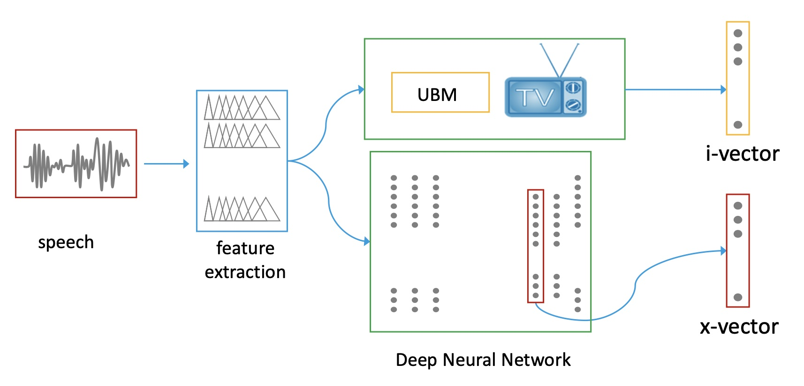

# Introduction

*Speaker Recognition* is a biometric task that allows an automated system to identify a speaker by creating a model of the features of a speaker's utterances. Speaker recognition is applicable to the domains of security (*speaker verification*), information retrieval (*speaker identification*) and has common applications in today's smart devices or voice activated services.[@alam2020survey] A smart device could consider the context of a request better if it is able to recognize which user has issued the command.

The following examples illustrate an interaction between a user and an automated system through prompts. Intuitively it can be seen why it is necessary to know the identity of the speaker addressing the system.

  > "Hey [ASSISTANT], call Mom!"

[whose mom?]  , [which user's adressbook should be queried?]  
  
  > "OK [ASSISTANT], play my workout mix" - [which user's playlist?]  
  > "Hey [ASSISTANT]" (command issued by an unauthorised user)

[system **refuses** to process command!]


While early work on this topic focused on *Gaussian mixture models* with *Hidden Markov Models* (GMM-HMM), recently attention has shifted toward the use of *Deep neural networks* (DNN) and C*onvolutional neural networks* (CNN). i-vectors and d-vectors have been the base of many speaker recognition systems and are described in [Background](#approaches-to-speaker-recognition). x-vectors also reduce the high dimensional feature space, but utilize a *deep neural network* (DNN) to discriminate between speakers, as opposed to the gaussian mixure model (GMM) in the case of i-vectos. An added benefit is that x-vector models only require speaker labels on training data, while i-vectors require transcribed data.[@snyder2018x]

## Research Questions:


1. What stategies can be used to recognise individual agents in spoken dialogue?

1. What is the accuracy of the model?

1. How does the model compare to existing methods?

1. To what extent can speaker recognition be modelled using high-level instructions?


# Background

## Approaches to Speaker Recognition

*Speaker Recognition* (SR) models fall into two categories, *text-dependant speaker verification* and *text-independant speaker verification*. In the former training data must be trancribed, whereas in the case of the latter there are no lexigraphical contraints imposed.[@lukic2016speaker] Avoiding the need for transcription has the benefit of exposing a larger body of potential training data. This research focusses on the latter approach.

The general method for SR is to extract speaker embeddings from utterances and compare them using some distance function. The inherrant problem with this high dimensional space is the vector length, which in turn affects the data rate.

Both i-vectors and x-vectors map variable length utterances to fixed length vectors.

In neural network systems, the outputs of the neural network are the embeddings (or d-vectors).

Figure 1 shows the typical i and x-vector pipeline. Note that the x-vector method is plug and play with the i-vector method. Also we note that the x-vector is the layer before final output layer with softmax applied.


 @kellyvectors

## i-vectors
- GMM gaussian mixture model
- UBM universal background model
- maximize ${\mathcal{L}}$ (likelihood)

## x-vectors
- state-of-the-art approach
- incorporates temperal context (TDNN layers)
- x-vector models can capitalise on larger training sets. i-vector models tend to max out after a certain amount of training data and suffer diminishing returns with increased training data
- no need to transcribe data, lexicon free
- possible to augment datasets using noise leading to increased accuracy

After the x-vectors are extracted, a Linear Discriminent Analysis (LDA) is used to normalise and reduce the vector dimensions, before finally using a Probabilistic Linear Discriminent Analysis (PLDA) to perform the classification.

## Convolutional Neural Network

Convolutional nural networks (CNN) are different from DNNs in that they do not need to have dense fully connected layers. They are commonly used in Computer Vision but it has also been shown that they are capable of capturing the temporal context as well as or better than HMMs.[@salehghaffari2018speaker]


# Datasets

The consulted works do not stress the significance of the particular dataset. Of importance is a varied set of speakers, and the presence of noise. The trained model is subject to a high degree of error in the presence of a high signal-noise-ratio if it was not trained on data with sufficient noise.[@snyder2018x] Accuracy can also vary when sampling data from different recording devices, using different compression or under varying auditory spaces, which the model may interpret as noise. Therefore it is beneficial to have sufficient variance in training data.

It was initially planned to use the Spotify Podcast Dataset, but the absence of speaker labels renders this dataset unsuitable for x-vector training. Other candidates included "NIST speaker recognition evaluation 2016" and "Speakers in the Wild Core".

The Kaggle dataset contains speech samples from 5 different speakers, each having 1500 samples. In addition there are noise samples which are used for data augmentation.

The Keras model is trained using the Kaggle Speaker Recognition Dataset, containing speeches of prominent leaders. The pretrained x-vector model is trained on VoxCeleb[@Chung18b] and augmented with noise from the Musan Corpus[@musan2015] and RIR Noises[@ko2017study].

## Data Preparation

For the purpose of speaker recognition the most significant label needed for training is a speaker ID. Because the data used is already sorted by speaker, little preparation was necessary. There are 7501 samples available which we spilt into train/validate set. A validation split of 0.2 yields 6000 entries for training and 1500 for validation.

The noise recording used for data augmentation was not sampled at the same data rate as the speaker recordings and as such it was necessary to resample the noise recordings to match the data rate of the voice recordings, 1600 Hz.

## Data Augmentation

To simulate audio samples under varying circumstances, the existing voice samples were augmented by adding noise. This process results in extra training data, consisting of the "clean" samples and those augmented with noise. This is especially useful for the Kaggle dataset which is relatively small.

Both the pretrained x-vector model and the self trained CNN model have used data augmentation.

# Approach

The approach is to implement speaker recognition using the Keras framework. The model will be trained on available data and compared with the pretrained model's performance.

## CNN

A convolutional neural network was trained on the Kaggle Dataset. It should be noted that convolutional neural networks are also highly performant in Speaker Recognition because the CNN is adept at capturing the temperal information of speech. The CNN is described exclusively in Keras and also serves to test the viability of the framework.

1. First the dataset of speech samples is prepared, with the speaker as label.
2. Background noise is resampled to match the data rate of the speech samples and added to the recordings.
3. A Fast Fourier Transformation (FFT) is applied to resulting samples. The FFT assures a uniform data length for all input to the CNN.
4. Finally, a 1D CNN is used to predict the correct speaker given noisy speech samples with the FFT applied.

> The code for the CNN can be found in the repository under `src/` or opened in Google Colab using the following link: [](https://colab.research.google.com/drive/1CONC03D32xIcZ1m1Bt4LBvpR0HQ-5394?usp=sharing)

## Keras

<!--  -->

[Keras](https://keras.io/) is a high level framework for deep neural networks [@chollet2015keras].
- runs on top of other frameworks (TensorFlow, etc)
- less code needed to describe network / model
- framework-specific concepts are abstracted (focus on the model, not the framework)
  - higher abstraction than TF
- integrated in TF 2.0 (can use same pipeline, tweak as needed)

```python
inputs = keras.layers.Input(shape=input_shape, name="input")

x = keras.layers.Conv1D(filters, 1, padding="same")(x)
# some lines omitted for brevity ...
x = keras.layers.AveragePooling1D(pool_size=3, strides=3)(x)
x = keras.layers.Flatten()(x)
x = keras.layers.Dense(256, activation="relu")(x)
x = keras.layers.Dense(128, activation="relu")(x)

outputs = keras.layers.Dense(num_classes, activation="softmax", name="output")(x)
model =  keras.models.Model(inputs=inputs, outputs=outputs)
```

Finally we compile the model:
```python
model.compile(
    optimizer="Adam", loss="sparse_categorical_crossentropy", metrics=["accuracy"]
)
```

## Kaldi

Kaldi is powerful tookist for ASR and other speech processing tasks.[@Povey_ASRU2011] The Kaldi toolkit is used for the x-vector analysis.

# Evaluation

The models performance is evaluated through cross entropy loss and equal error rate.
**EER** Equal Error Rate is the point where the False Acceptance Rate and False Rejection Rate are equal, and defined according the following formula.[@das2019deep]

$$
\begin{aligned}
R_{FA} &= R_{FR} \\
R_{FA} &= \frac{\textrm{Number of False Acceptances}}{\textrm{Number of Impostor Accesses}} \\
R_{FR} &= \frac{\textrm{Number of False Rejections}}{\textrm{Number of Target Accesses}}
\end{aligned}
$$

## Results

The CNN trained on the Kaggle speaker recognition dataset reaches a validation accuracy above 95% after only 10-15 epochs. The final validation accuracy and loss after 25 epochs are:

> val_loss: 0.0635 - val_accuracy: 0.9847


The x-vector model trained on VoxCeleb shows the following metrics when validated on the [VoxCeleb2 Test](https://thor.robots.ox.ac.uk/~vgg/data/voxceleb/vox1a/vox2_test_aac.zip) data: 

> EER: 3.224%

## Findings

While both the x-vector model and the CNN model achieved similar accuracy scores, they were trained on vastly different datasets. As such it not possible to draw significant conclusions from these findings. However, in the consulted literature data is reported on  models trained under equal conditions which does suggest that the x-vector approach will outperform other models, especially when trained on larger datasets. The limited size of the Kaggle Dataset supports this claim. In this case the CNN was able to capture enough information about the speakers. It cannot be assumed that this level of accuracy extrapolates to very large datasets. 

### Environment
In general all datascience tools and frameworks require a carefully configured environment

Environment and dependency management are not features of python or c++ distributions, and often differ between various OSs and platform versions. To make matters worse there are various manners of managing packages which may be agnostic or even conflict with each other if not carefully configured.

For the Keras part of the project [pyenv](https://github.com/pyenv/pyenv) was used to wrangle the python environment. Training was done on [Google Colab](https://colab.research.google.com/) which offers a suitable environment for Python and TensorFlow. In most cases all necessary packages are already installed. If they are not, they can easily be installed using the usual tools like *pip*.

For the Kaldi experiment, setting up a suitable test environment proved particularly challenging. Kaldi is a c++ based framework that has a number of dependencies to install and must be built from source. While the Kaldi documentation states that it should run on Windows and *most* Unix or Unix-like systems, this proved challenging. Building Kaldi on a freshly configured Ubuntu VM proved unsuccessful despite carefully adhering to the install instructions and successfully installing the necessary dependecies. The particular version of linux may have been the culprit, but extensive testing was out of scope. An attempt to build the toolchain on OS X failed because one of the dependencies (the math library) was not yet updated to support the *host* OS. Luckily, the *undocumented* Docker images did work. In retrospect, had this option been more transparent in the documentation, it would have been attempted first and is likely the most portable/reproducable manner of interaction with the framework.

While the Google Colab environment is very nice to work with because of its fast GPU support, there are a few caveats to be aware of. Firstly, GPU allocation is randomized. The particular GPU assigned to the session is not guaranteed to be of any particular type when using the free tier. At certain points in this project, training proceeded very slowly, while at others they were very fast. Additionally, there is a 12-hour timeout on session length (the [free tier](https://research.google.com/colaboratory/faq.html#resource-limits) is not meant for long unattended training). Initially being unaware of this, lead to the accidental loss of a trained model earlier in the project.

### Datasets

There were several challenges involving the datasets.
It was an error on the part of this researcher to conclude that the speaker IDs were included in the Spotify Podcast dataset. While it seemed that this might have been the case considering the automatic transcription and diarization, it was never stated explicitly that speaker IDs were present. This oversight, combined with the lengthy data access approval process unfortunately revealed the unsuitability of the dataset later in the project and cost valuable time.

Having realised the need to find an alternate dataset, SITW and VoxCeleb were considerred. Both of these datasets are extensive enough and often cited in the consulted literature. VoxCeleb is unfortunately so large (c.a. 80 Gb compressed) that it was not possible to host on the available hardware. A possibility would have been to use a subset of the data, were it not that the data is only distributed in a compressed and segmented archive. Attempts to extact a single archive segment without the remaining parts were unsuccessful. The curators of SITW were also contacted for access to the data and access was granted. This, however, happened quite late in the project timeline and the datasize combined with the required training time (potentially 100 hours or more) would have been prohibitive.

Because of the aforementioned reasons, the Kaggle dataset became the only viable option. Only because of its immediate availability and moderate footprint was it chosen. As stated earlier in this paper, the x-vector approach benefits from larger datasets and should be evaluated in this fashion in follow-up work. Fortunately data augmentation could be applied to offset the limited size of the dataset.

# Conclusion

The difficulties experienced setting up and running the Kaldi experiments only served to validate the utility of high-level toolkits. While older frameworks like Kaldi clearly still have their utility and position in modern research, the premise that datascientists still struggle with implementation details holds true. Time spent managing these aspects of machine learning is time not spent training, tuning, or developing new models.

Keras is as powerful as any other framework and allows for elegant model description in less code. The CNN trained in Keras achieved a very high accuracy. However, there are signs of overfitting which were not addressed. Additionally it was not possible to train it on the extensive data that the x-vector model was trained on, and as such any comparison is not significant.


- lessons learned

> Don't underestimate the time required to aquire, and process speech datasets!

It may be obvious to most, but working with audio data requires **much** more time than working with textual data. I underestimated the leadtime, storage space, and processing time needed to work with these datasets.

Kaldi is very powerful and has most features required for ASR...but it is challenging to work with. Keras is comparitively very forgiving and approachable.

- directions for future work
  - hyperparameter tuning - Experimenting with the learning rate and dropout rate could yield different results. This would likely be of greater importance 
  - train CNN on larger dataset
  - evaluate language transfer loss
  - implement the full x-vector pipeline in Keras

<!-- add all sources in case we forgot to cite -->
---
nocite: |
    @*
...

# References
<!-- refernces are automatically added by Pandoc during pdf conversion -->
